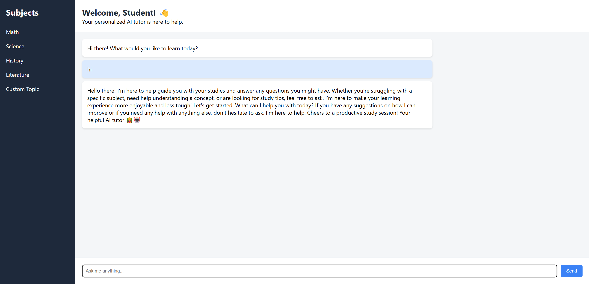
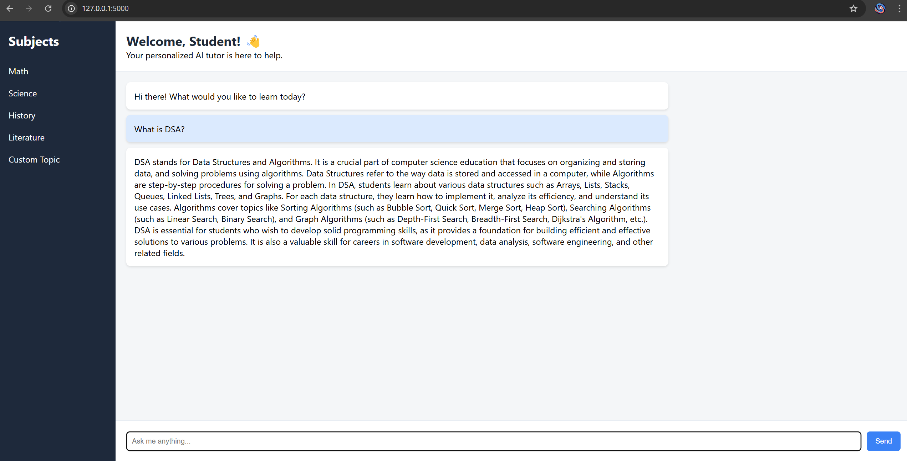
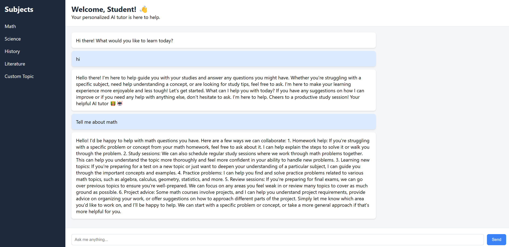

AI Personalized Tutor - How to Run

1. Install Python (if not already):
   https://www.python.org/downloads/

2. Double-click `run.bat` (in this folder)

3. It will open the app at:
   http://127.0.0.1:5000

4. Ask questions to your AI tutor and learn!

